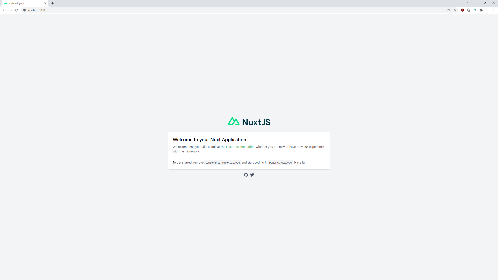

# Make a Nuxt App with create-nuxt-app

A demo app to show how to create a nuxt App using `create-nuxt-app`.

## Prerequisites

- [node](https://nodejs.org/en/) - Recommend you have the latest LTS version installed.
- A text editor, recommend [VS Code](https://code.visualstudio.com/) with the [Vetur](https://marketplace.visualstudio.com/items?itemName=octref.vetur) extension.
- A terminal, recommend using [VS Code's integrated terminal](https://code.visualstudio.com/docs/editor/integrated-terminal).

- [yarn](https://classic.yarnpkg.com/lang/en/docs/install/#mac-stable) - recommend to install Yarn through the npm package manager.
    - `npm install --global yarn`


## Using create-nuxt-app

To get started quickly, you can use create-nuxt-app .

```
yarn create nuxt-app <project-name>
```

It will ask you some questions (name, Nuxt options, UI framework, TypeScript, linter, testing framework, etc). To find out more about all the options see the [create-nuxt-app documentation](https://github.com/nuxt/create-nuxt-app/blob/master/README.md).

```
> yarn create nuxt-app nuxt-netlify-app
yarn create v1.22.15
...
create-nuxt-app v4.0.0
✨  Generating Nuxt.js project in nuxt-netlify-app
? Project name: (nuxt-netlify-app)
```

[TypeScript](https://www.typescriptlang.org/) is a strongly typed programming language that builds on JavaScript, giving you better tooling at any scale. Detecting errors in code without running it is referred to as static checking. Determining what’s an error and what’s not based on the kinds of values being operated on is known as static type checking.

TypeScript checks a program for errors before execution, and does so based on the kinds of values, it’s a static type checker.

```
? Programming language:
  JavaScript
❯ TypeScript
```

[Yarn](https://yarnpkg.com/) is a package manager for your code. It allows you to use and share code with other developers from around the world. Yarn does this quickly, securely, and reliably so you don't ever have to worry.

```
? Package manager: (Use arrow keys)
❯ Yarn
  Npm
```

[Tailwind CSS](https://tailwindcss.com/) is a UI Framework for your code. Tailwind CSS is basically a utility-first CSS framework for rapidly building custom user interfaces. It is a highly customizable, low-level CSS framework that gives you all of the building blocks you need to build bespoke designs without any annoying opinionated styles you have to fight to override.

```
? UI framework:
  None
  Ant Design Vue
  BalmUI
  Bootstrap Vue
  Buefy
  Chakra UI
  Element
  Oruga
  Primevue
  Tachyons
❯ Tailwind CSS
  Windi CSS
  Vant
  View UI
  Vuetify.js
```

In our case, we don't really need to select a module. We will just select the Git-based headless CMS.
```
? Nuxt.js modules: (Press <space> to select, <a> to toggle all, <i> to invert selection)
 ◯ Axios - Promise based HTTP client
 ◯ Progressive Web App (PWA)
❯◯ Content - Git-based headless CMS
```

[Prettier](https://prettier.io/docs/en/) is an opinionated code formatter. It enforces a consistent style by parsing your code and re-printing it with its own rules that take the maximum line length into account, wrapping code when necessary

```
? Linting tools: (Press <space> to select, <a> to toggle all, <i> to invert selection)
 ◯ ESLint
❯◯ Prettier
 ◯ Lint staged files
 ◯ StyleLint
 ◯ Commitlint
```

For this tutorial, we will skip testing frameworks as this is a whole new article in itself to just explain the different types of ways to test and explain the different testing frameworks.
```
? Testing framework:
❯ None
  Jest
  AVA
  WebdriverIO
  Nightwatch
```

Nuxt provides alternatives ways to render our application. In our case, we would like to have a way to **generate a static site**.

With [static site generation](https://nuxtjs.org/docs/concepts/static-site-generation/), you can render your application during the build phase and deploy it to any static hosting services such as Netlify, GitHub pages, Vercel etc. This means that no server is needed in order to deploy your application.
```
? Rendering mode: (Use arrow keys)
❯ Universal (SSR / SSG)
  Single Page App
```

We would like to target a static hosting such as Netlify.
```
? Deployment target:
  Server (Node.js hosting)
❯ Static (Static/Jamstack hosting)
```

We can select any of the Development tools in this step, but in our case we will select Dependabot as it notifies us of outdated dependencies and assists in patching different security issues found in outdated dependencies.

```
? Development tools: (Press <space> to select, <a> to toggle all, <i> to invert selection)
 ◯ jsconfig.json (Recommended for VS Code if you're not using typescript)
 ◯ Semantic Pull Requests
❯◯ Dependabot (For auto-updating dependencies, GitHub only)
```

Here you'll be able to set the author of the application project. In this case, it is **chrisatrotter** which is my Github user.
```
? What is your GitHub username? (chrisatrotter)
```

Having a version control system is highly recommended to ensure that your project is not only persisted locally. It will ensure that your work will be available regardless what happens with your computer.
```
? Version control system: (Use arrow keys)
❯ Git
  None
```

You made it! 🥳🎉

```
🎉  Successfully created project nuxt-netlify-app

  To get started:

	cd nuxt-netlify-app
	yarn dev

  To build & start for production:

	cd nuxt-netlify-app
	yarn build
	yarn start


  For TypeScript users.

  See : https://typescript.nuxtjs.org/cookbook/components/
✨  Done in 391.39s.
```

Now you should have all the dependencies installed after answering all the questions. The next step is to navigate to the project folder and launch it:

```
cd nuxt-netlify-app
yarn dev
```

You have successfully created and launched your Nuxt application! 🎉

If you got to `http://localhost:3000` you should see a website as shown below:


